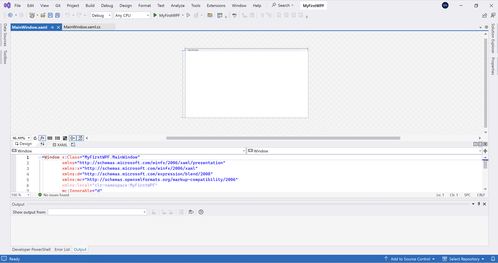

# Catatan Kuliah: WPF

Materi ini merupakan pengantar penggunaan WPF dalam pembuatan aplikasi. Pada materi ini, akan dipelajari cara membuat Hello, World! sederhana pada WPF tanpa menggunakan XAML untuk menekankan paradigma OOP pada membuatan aplikasi.

## Daftar Isi

- [Catatan Kuliah: WPF](#catatan-kuliah-wpf)
  - [Daftar Isi](#daftar-isi)
  - [Author](#author)
  - [Pengenalan WPF](#pengenalan-wpf)
  - [Membangun Hello, World! dengan WPF](#membangun-hello-world-dengan-wpf)
  - [Referensi](#referensi)


## Author

- Bintang Nuralamsyah

## Pengenalan WPF

WPF merupakan singkatan dari **Windows Presentation Foundation**. Teknologi ini merupakan salah satu pendekatan terbaru dari Microsoft dalam membangun tampilan antar muka pengguna (*GUI*). Untuk membangun dan menjalankan WPF diperlukan .NET *framework*. Dengan menggunakan *framework* seperti WPF, membangun antarmuka menjadi lebih mudah. Pengembang tidak perlu secara mandiri membuat elemen-elemen antarmuka seperti *textbox*, *label*, dan elemen-elemen lainnya secara manual. Semua hal-hal mendasar tersebut telah diurus oleh WPF sehingga pengguna hanya perlu berfokus untuk membuat aplikasi.

Beberapa manfaat menggunakan WPF:

- Microsoft menggunakan WPF pada aplikasi-aplikasi terbarunya, termasuk visual studio
- Penggunaan XAML pada WPF mempermudah pengembang dalam membuat dan menyunting *GUI*
- Termasuk teknologi yang masih dirawat dan dikembangkan oleh Microsoft

## Membangun Hello, World! dengan WPF

"Hello, World!" merupakan aplikasi sederhana yang umumnya dibuat ketika seseorang mempelajari bahasa pemrograman/teknologi baru. Berikut langkah-langkah untuk membuat Hello, World! dengan WPF:

1. Membuka Visual Studio
2. Pilih "Create a new project"

    

3. Pilih "WPF Application" dengan spesifikasi bahasa C#

    

4. Beri nama project sesuai keinginan

    

5. Pilih framework .NET yang diinginkan (tutorial ini dibuat dengan menggunakan .NET 8.0)

    

6. Tampilan awal dari project akan terlihat di layar sebagai berikut

    

    Paradigma pemrograman beriorientasi objek sangat lekat dalam menyusun tampilan pengguna pada WPF. Komponen-komponen antar muka yang berada pada jendela aplikasi dapat disimbolkan sebagai objek. Sebagai contoh, perhatikan tampilan aplikasi Hello, World! yang akan kita buat pada ilustrasi di bawah ini

    

    Tampilan tersebut tersusun dari beberapa komponen (yang selanjutnya kita sebut sebagai objek) diantaranya objek *button* bertuliskan "Say Hello!", objek *label* bertuliskan "Hello, WPF!", dan objek *grid* yang menjadi *container* objek *button* dan objek *label*. Sebenarnya, WPF menyediakan fitur XAML untuk memudahkan kita dalam membangun tampilan antarmuka. Namun sebagai awalan, mari kita membuat tampilan pada ilustrasi di atas dengan menggunakan C# murni tanpa XAML supaya lebih memahami kaitan antara OOP dengan WPF.

7. Hapus file dengan nama `App.xaml` dan `MainWindow.xaml`
8. Buat *class* baru pada *project* dengan nama `
MyWindow.cs`

9. Ketikkan kode berikut untuk mendefinisikan  *class* `MyWindow` pada `MyWindow.cs`.

    ```csharp
    using System;
    using System.Windows;
    using System.Windows.Controls;

    namespace ManualWPF
    {
        public class MyWindow : Window
        {

        }
    }
    ```

    **Perhatikan** baris yang mengandung *keyword* `namespace`! isi `namespace` dengan nama projek kalian! sebagai contoh nama projek saya adalah `ManualWPF` sehingga pada bagian `namespace` milik saya tertulis:

    ```csharp
    namespace ManualWPF
    ```

    Untuk membangun sebuah aplikasi berantarmuka dengan WPF, kita memerlukan beberapa kode yang telah disediakan oleh framework .NET. oleh karena itu kita meng-*import*-nya dengan menggunakan *keyword* `using`

     ```csharp
    using System;
    using System.Windows;
    using System.Windows.Controls;
    ```

10. Selanjutnya, mari mulai merancang antarmuka sesuai dengan ilustrasi di atas. Objek paling pertama yang kita buat adalah objek dari kelas `Grid`. Objek ini berfungsi sebagai *container* untuk meletakkan komponen-komponen antarmuka kita sekaligus mengatur posisi mereka. Tambahkan `constructor MyWindow()` pada *class* `MyWindow`

    ```csharp
    using System;
    using System.Windows;
    using System.Windows.Controls;

    namespace ManualWPF
    {
        public class MyWindow : Window
        {
            public MyWindow()
            {
                Grid myGrid = new Grid();
                this.Content = myGrid;
            }

        }
    }
    ```

    Pada fungsi `constructor` di atas, kita menginisiasi `object` dengan tipe data `Grid` dengan nama `myGrid`. kemudian, `object` tersebut kita *assign* sebagai `property Content` dari `class MyWindow` supaya nanti kita aplikasi di-*compile* dan dijalankan, `object myGrid` dan `object-object` di dalamnya (yang akan kita definisikan nanti) muncul di window aplikasi.

11. Supaya aplikasi kita dapat dijalankan, tambahkan `method Main()` pada definisi kelas kita.

    ```csharp
    using System;
    using System.Windows;
    using System.Windows.Controls;

    namespace ManualWPF
    {
        public class MyWindow : Window
        {
            public MyWindow()
            {
                Grid myGrid = new Grid();
                this.Content = myGrid;
            }

            [STAThread]
            public static void Main()
            {
                Application app = new Application();
                app.Run(new MyWindow());
            }
        }
    }
    ```

    jangan melupakan `[STAThread]` karena dalam definisi yang sederhana, atribut ini diperlukan pada `method` yang menjadi **entry point** pada aplikasi yang menggunakan **Windows Form**.

12. Klik ikon segitiga hijau pada bagian atas jendela visual studio untuk menjalankan aplikasi

    

    jendela aplikasi baru akan terbuka dan nampak sebagai berikut:

    

13. Selanjutnya, mari kita menambahkan `object Button` pada jendela aplikasi. `Button` ini nantinya apabila diklik akan memunculkan tulisan "Hello, World!" pada bagian kosong di jendela aplikasi. Tambahkan potongan kode berikut setelah kita menginisiasi `object myGrid` sehingga--

    ```csharp
    Button button1 = new Button();
    button1.Content = "Say Hello, World!";
    button1.Height = 23;
    button1.Margin = new Thickness(96, 50, 107, 0);
    button1.VerticalAlignment = System.Windows.VerticalAlignment.Top;
    button1.Click += new RoutedEventHandler(button1_Click);
    myGrid.Children.Add(button1);
    ```

    --`class MyWindow` kita menjadi sebagai berikut

    ```csharp
    using System;
    using System.Windows;
    using System.Windows.Controls;

    namespace ManualWPF
    {
        public class MyWindow : Window
        {
            public MyWindow()
            {
                Grid myGrid = new Grid();
                this.Content = myGrid;

                Button button1 = new Button();
                button1.Content = "Say Hello, World!";
                button1.Height = 23;
                button1.Margin = new Thickness(96, 50, 107, 0);
                button1.VerticalAlignment = System.Windows.VerticalAlignment.Top;
                myGrid.Children.Add(button1);
            }

            [STAThread]
            public static void Main()
            {
                Application app = new Application();
                app.Run(new MyWindow());
            }
        }
    }
    ```

    pada potongan kode tersebut, kita mendefinisikan `object Button` dengan nama `button1`. `object button1` memiliki beberapa `property` seperti `Height`, `Width`, `Margin`, yang akan mempengaruhi bagaimana `object Button` tersebut nampak di jendela aplikasi. Setelah kita mendefinisikan tampilan dari `object button1`, kita tambahkan `object` tersebut pada `myGrid`-- 

    ```csharp
    myGrid.Children.Add(button1);
    ```

    --supaya dapat terlihat oleh pengguna di jendela aplikasi.

    Apabila kita menjalankan aplikasi maka tampilan yang akan muncul adalah sebagai berikut:

    

    Tidak akan terjadi apapun saat kita meng-klik `button1`, karena kita hanya mendefinisikan tampilannya, tanpa perilakunya. Untuk mendefinisikan perilaku, kita memerlukan sebuah `Event Handler`. Interaksi antara pengguna dengan aplikasi akan men-*fire* `Event`-`Event` tertentu. Seperti contoh ketika seorang pengguna meng-klik `button1`, maka `Click Event` akan ter-*generate*. atau ketika seorang pengguna mengetikkan namanya pada sebuah `InputBox`, `KeyDown Event dan KeyUp Event` akan ter-*generate* pada sistem. `Event Handler` adalah `method`-`method` yang tereksekusi sebagai **respons** dari terjadinya suatu `Event` pada aplikasi. Pada kasus kali ini, kita ingin **ketika** `Click Event` ter-generate akibat pengguna **meng-klik** `button1` pada jendela aplikasi, applikasi kita menampilkan tulisan "Hello, World!". Oleh karenanya kita memerlukan sebuah `method` yang akan dipanggil ketika `Click Event` pada `button1` terdeteksi.

14. Tambahkan `method` berikut pada `class MyWindow`

    ```csharp
    void button1_Click(object sender, RoutedEventArgs e)
    {
        MessageBox.Show("button1 diklik");
    }
    ```
    ketika `method` ini dieksekusi, akan muncul sebuah `Message Box` bertuliskan "button1 diklik" pada layar pengguna.

15. Kemudian sebelum baris

    ```csharp
    myGrid.Children.Add(button1);
    ```

    tambahkan potongan kode berikut

    ```csharp
    button1.Click += new RoutedEventHandler(button1_Click);
    ```

    sehingga `class MyWindow` menjadi seperti ini
    
    ```csharp
    using System;
    using System.Windows;
    using System.Windows.Controls;

    namespace ManualWPF
    {
        public class MyWindow : Window
        {
            public MyWindow()
            {
                Grid myGrid = new Grid();
                this.Content = myGrid;

                Button button1 = new Button();
                button1.Content = "Say Hello, World!";
                button1.Height = 23;
                button1.Margin = new Thickness(96, 50, 107, 0);
                button1.VerticalAlignment = System.Windows.VerticalAlignment.Top;
                button1.Click += new RoutedEventHandler(button1_Click);
                myGrid.Children.Add(button1);
            }

            void button1_Click(object sender, RoutedEventArgs e)
            {
                MessageBox.Show("button1 diklik");
            }

            [STAThread]
            public static void Main()
            {
                Application app = new Application();
                app.Run(new MyWindow());
            }
        }
    }
    ```

    dengan demikian, kita telah menambahkan `Event Handler` untuk `Click Event` pada `button1`. Ketika `button1` di-klik oleh pengguna, `method button1_Click()` akan dieksekusi sebagai **respons** dari event `Click` pada `button1`. Apabila program dijalankan dan `button1` di-klik, maka akan nampak sebagai berikut:

    

16. Sekarang saatnya menambahkan label pada aplikasi kita. Label bertuliskan "Hello, World!" akan muncul ketika kita meng-klik `button1`. Tambahkan potongan kode berikut pada `constructor MyWindow`:

    ```csharp
    Label label1 = new Label();
    label1.Margin = new Thickness(84, 115, 74, 119);
    grid.Children.Add(label1);
    ```

    potongan kode tersebut berfungsi untuk membuat `object` baru yaitu `object Label` dengan nama `label1`. Tujuan kita adalah membuat `label1` bertuliskan "Hello, World!" pada saat kita meng-klik `button1`.

17. Untuk itu, kita perlu mengubah definisi dari `method button1_Click()`. Pada `method` tersebut kita perlu mengubah `property Content` dari `label1` menjadi "Hello, World!" ketika `Click Event` ter-*fire* pada `button1`. Masukkan potongan kode berikut pada `method button1_Click()` sebagai upaya kita memanipulasi `property Content` dari `label1`

    ```csharp
    label1.Content = "Hello, World!"
    ```

    Apabila kita menjalankan aplikasi, maka akan muncul `compile error` dengan deskripsi `The name 'label1' does not exist in the current context`. Hal ini terjadi karena `variable label1` merupakan `local variable` pada `constructor MyWindow`, sehingga `method button1_Click()` tidak mengerti variable tersebut. Untuk menyelesaikan masalah tersebut, kita dapat membuat `property label1` pada `class MyWindow` sehingga `method button1_Click()` dapat mengakses `label1`. Tambahkan `property private Label label1` pada `class MyWindow`

    ```csharp
    private Label label1;
    ```

    kemudian ubah kode definisi `label1` pada tahap 16 menjadi sebagai berikut

    ```csharp
    label1 = new Label();
    label1.Margin = new Thickness(84, 115, 74, 119);
    grid.Children.Add(label1);
    ```

18. Jalankan aplikasi kemudian klik tombol "Say Hello, World!", maka akan tampak sebagai berikut

    

Voila! aplikasi Hello, World! berhasil dibuat!

## Referensi

- https://learn.microsoft.com
- http://www.tbiro.com
- https://wpf-tutorial.com
- https://stackoverflow.com/
